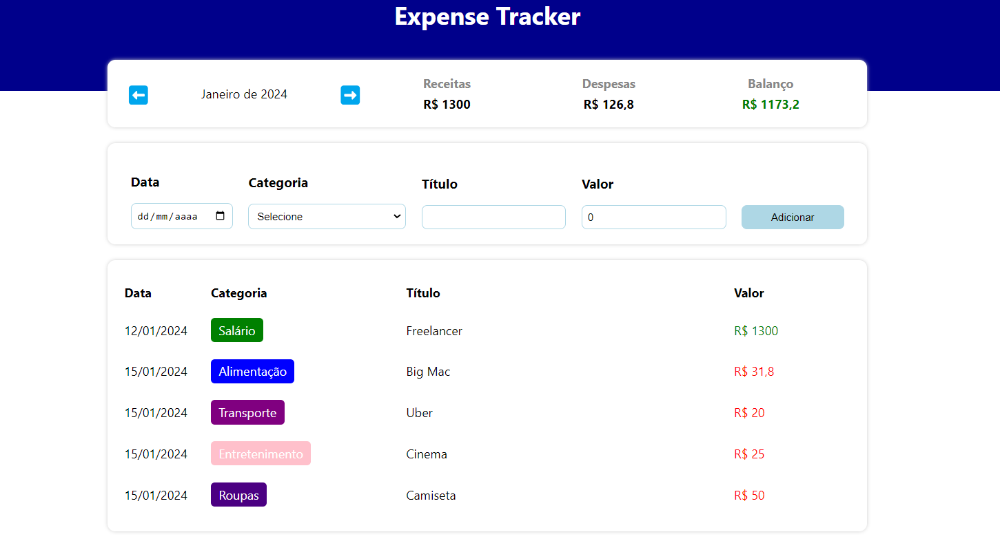

# Expense Tracker



Este repositório contém uma aplicação de um Gerenciador de Despesas pessoais com ReactJS.

## 📖 Sobre
O Expense Tracker é uma aplicação web desenvolvida em ReactJS para auxiliar no controle financeiro pessoal, permitindo o registro e monitoramento de despesas e receitas.

## Tecnologias utilizadas


## 📝 Funcionamento

- Adicione novas transações especificando a **data**, **categoria**, **título** e **valor**.
- Utilize categorias predefinidas com diferentes cores entre si para organizar suas transações.
- Visualize todas as trasações mensais filtrando pelo mês e ano.
- Visualize o valor das despesas e receitas mensais em tempo real.

## ⚙️ Como executar localmente

Para executar a aplicação localmente, siga os passos abaixo:

### 1. Clone este repositório:

```bash
  git clone https://github.com/eullergomesexpense_tracker_react.git
  
  cd expense_tracker_react
```

### 2. Instale as dependências

 Instalar todas as dependências listadas no arquivo package.json
```bash
  npm install
```


### 3. Inicie a aplicação

```bash
  npm start
```
Após isso, acesse http://localhost:3000 em seu navegador.

## 🏆 Contribuição
* Sinta-se à vontade para contribuir, reportar problemas ou sugerir melhorias.
* Crie um fork do repositório, faça suas modificações e envie um pull request.
